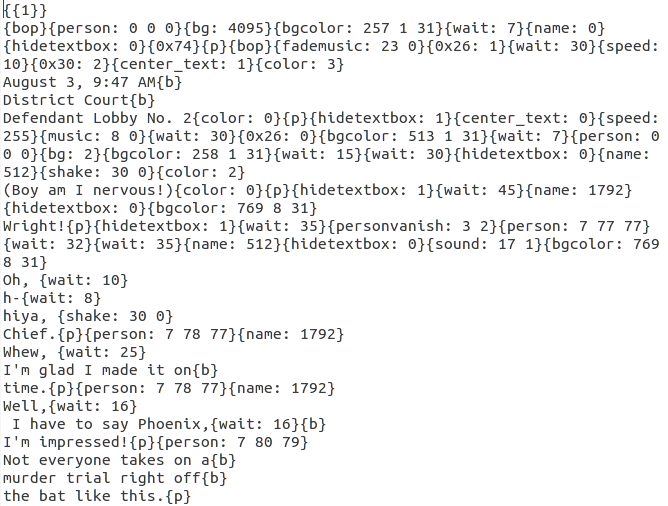
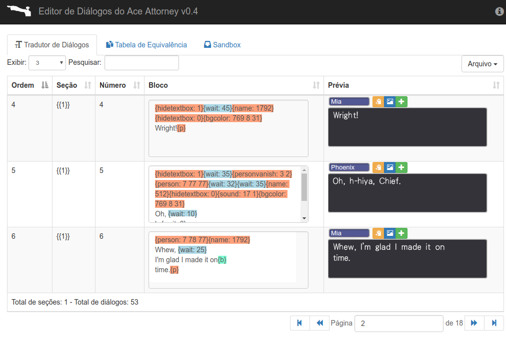
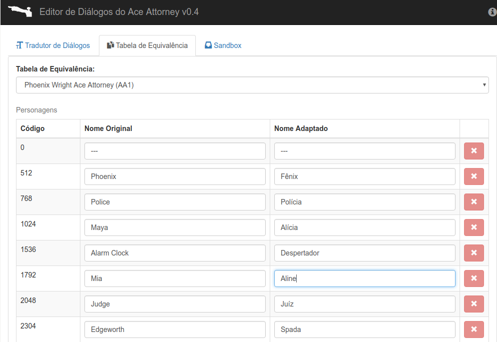
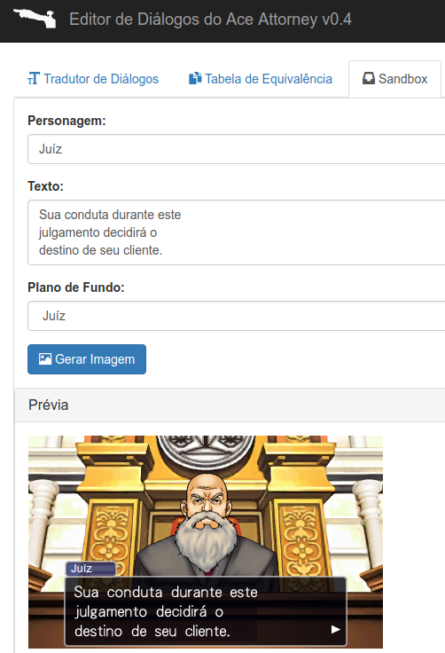

# Editor de Diálogos do Ace Attorney

**Programa desenvolvido para agilizar na tradução e revisão de scripts do jogo "Ace Attorney Trilogy", para Nintendo 3DS.**

[Prévia ao vivo](http://www.romhacking.net.br/tools/aade/)

"Ace Attorney Trilogy" (AAT) é um jogo de gênero adventure, point'n
click e visual novel, onde jogamos na pele de um advogado que deve defender
clientes acusados de crimes que não cometeram. Foi lançado em 2014 para
Nintendo 3DS, tendo localização oficial para inglês e japonês.

Considerando o fato das versões de DS possuírem localização oficial para
espanhol, mas que a mesma foi abolida nesta trilogia de 3DS, em outubro de
2016, um romhacker alemão chamado "onepiecefreak", em conjunto com um grupo de
romhackers espanhóis, iniciaram [um projeto de fã-tradução não-oficial desse
jogo para espanhol](http://gbatemp.net/threads/translation-ace-attorney-trilogy.444652).
Nesse projeto, "onepiecefreak" desenvolveu [uma série de ferramentas gratuitas](https://mega.nz/#F!ZtJmXYzD!1XgA_iO4B6Tm2kef1kSUxQ), 
em Python e C#, que teoricamente permitem modificar quase tudo no jogo:

*   **Imagens**: Capaz de extrair e reinserir todas as imagens do jogo em formato PNG de alta definição;
*   **Scripts**: Capaz de extrair e reinserir os textos de todos os casos do jogo em arquivos TXT;
*   **Áudios**: Capaz de extrair e reinserir vozes em WAV, assim permitindo que o jogo seja dublado.

No entanto, um problema tem atrapalhado bastante: o formato dos scripts extraídos
é bastante bagunçado e poluído, misturando textos com várias tags de controle,
dificultando bastante a vida do tradutor, conforme pode ser notado na imagem abaixo:

O "Editor de Diálogos do Ace Attorney" é um programa desenvolvido para endereçar
o problema acima. Ele é capaz de interpretar todos os scripts do AAT extraídos pelas
ferramentas do "onepiecefreak", e realizar otimizações nos mesmos de modo a facilitar
a tradução e revisão dos scripts traduzidos.

Segue abaixo a lista de funcionalidades do programa:

*   **Quebra em blocos**: Separa o scripts em vários blocos de diálogo, fazendo com que o tradutor visualize cada janela de diálogos individualmente;
*   **Marcação textual**: Permite marcar, em cores específicas, as tags de controle. Útil para separar os textos das tags, assim facilitando a vida do tradutor. Também é usado para marcar as ocorrências dos nomes dos personagens nos scripts;
*   **Adicionar blocos**: Permite adicionar um novo bloco abaixo do atual. Útil para casos onde é preciso expandir o texto, desde que usado com moderação;
*   **Prévia em tempo real**: Adiciona, ao lado do bloco de diálogo editável, uma prévia de como os textos ficarão ingame. A prévia consegue simular efeitos de mudança de cor, centralização de texto, e também é capaz de marcar de vermelho os blocos supostamente inválidos;
*   **Identificação de personagens**: É capaz de determinar, para cada bloco de diálogo, quem foi o personagem do jogo responsável. Desse modo, o tradutor já sabe quem falou o quê, facilitando na obtenção do contexto ao traduzir;
*   **Tabela de equivalência**: Permite ao tradutor personalizar o nome exibidos na identificação de personagens citada no item acima. Útil para traduções que desejam adaptar nomes, ao invés de mantê-los no original;
*   **Funções de pesquisa e filtragem**: Capaz de pesquisar textos em blocos do script, bem como controlar a quantidade de blocos exibidos por página;
*   **Funções de revisão**: Capaz de copiar textos de blocos para a área de transferência ignorando as tags, bem como de exportar as prévias para imagem em PNG. Útil para revisões textuais pós-tradução;
*   **Análise de scripts**: Permite analizar todos os blocos do script atual, de modo a identificar quais passam da margem, ou contém linhas largas com mais de 32 caracteres. Útil para revisões textuais pós-tradução;
*   ***Sandbox***: Permite gerar prévias de imagens *ingame*, com opção de mudar nome do personagem, texto do bloco e plano de fundo. Útil para testes e criação de "memes";

Para realizar as funções acima, são utilizadas as seguintes tecnologias:

*   Versão Web
	*   HTML5, para a montagem das páginas;
	*   CSS3, para a estilização dos textos nas prévias;
	*   JavaScript e [jQuery](https://jquery.com/), para programação de componentes de *frontend*;
	*   [Html2canvas](http://html2canvas.hertzen.com/), para conversão de prévias para PNG;
	*   [Bootstrap](http://getbootstrap.com/), para tornar esta página responsiva;
	*   [jQuery DataTables](https://datatables.net/), para montar a tabela com pesquisa e filtragem onde situam-se os blocos de diálogo e as prévias;
	*   [Clipboard.js](https://clipboardjs.com/), para permitir a cópia de textos de blocos para a área de transferência, sem as tags de controle;
	*   [jQuery highlightTextarea](http://garysieling.github.io/jquery-highlighttextarea/), para a marcação de texto nos blocos;
    *   [stash](http://rezitech.github.io/stash/), para armazenamento de configurações locais do usuário, como tema e idioma;
	*   [FileSaver.js](https://github.com/eligrey/FileSaver.js/), para permitir a geração e o salvamento de arquivos .TXT no lado do cliente;
	*   [Dark Checkboxes and Radio Buttons in CSS](https://www.bypeople.com/edit-this-fiddle-jsfiddle-24/), para uma melhor estilização visual desses componentes em ambos os temas claro e escuro;
	*   [Bootstrap Colorpicker](https://farbelous.github.io/bootstrap-colorpicker/), para campos de seleção de cor, usados na tela de configuração para mudar as cores das marcações de sintaxe dos <textarea>;
*   Versão Desktop
    *   [Electron.js](https://electronjs.org/), para conversão do conteiner web do programa para um app desktop multiplataforma;

#### Pré-Requisitos

*   Versão Web: Um navegador moderno atualizado. De preferência o Google Chrome ou Mozilla Firefox;
*   Versão Desktop: Sistema Operacional Windows 7 ou superior.

#### Como usar?

1.  Extraia os scripts do "Ace Attorney Trilogy" ou através das ferramentas do "DiegoHH", [ou do "onepiecefreak"](https://mega.nz/#F!ZtJmXYzD!1XgA_iO4B6Tm2kef1kSUxQ);
2.  No formulário situado na aba "Tradutor de Diálogos", faça o upload do script que deseja traduzir;
3.  Opcional: Para título de teste, você também pode ir em "Escolher arquivo na lista abaixo" e selecionar o "Teste.txt";
4.  No formulário situado na aba "Tabela de Equivalência", escolha o jogo referente ao script selecionado, para que a rotina de identificação de personagens funcione corretamente;
5.  Opcional: Na aba "Tradutor de Diálogos", escolha entre usar nomes originais ou adaptados;
6.  Opcional: Na aba "Tabela de Equivalência", altere os nomes dos personagens conforme desejar;
7.  No formulário situado na aba "Tradutor de Diálogos", clique no botão "Enviar" e espere o script terminar de ser interpretado. Geralmente leva alguns segundos;
8.  Após tê-lo carregado, aparecerá uma tabela paginada, contendo os blocos de diálogo separados em vários campos de texto, seguido de uma prévia ao lado. É o sinal de que já pode começar a traduzir;
9.  Faça a tradução do script, tomando os seguintes cuidados:
    *   Traduza os textos do script, bloco por bloco;
    *   Atente-se para os textos não passarem do bloco, nem conterem linhas longas com mais de 32 caracteres;
    *   Tome cuidado para não mexer nas tags e invalidá-las, visto que isso pode gerar travamentos no jogo. Recomenda-se que só mexa nelas se realmente necessário;
10.  Opcional: Também é possível alternar entre nomes originais ou adaptados a partir da tabela. Basta ir em "Arquivo -> Configurações" e alterar o valor do campo "Nomes na Tabela de Equivalência";
11.  Opcional: É possível analisar o script por inteiro, em busca de blocos inválidos. Basta ir em "Arquivo -> Analisar Scripts", configurar o formulário e clicar em "Iniciar Análise";
12.  **Importante**: Antes de fechar a tool, lembre-se de salvar o script clicando em "Arquivo -> Salvar Script"¹.

¹ Essa ferramenta atualmente não realiza a persistência de nada submetido a ela,
logo cabe ao usuário upar e salvar os scripts periodicamente, enquanto traduz
por ela. Se o script não for salvo, ele será perdido.

#### Imagens

#### Considerações gerais

Caso encontre algum bug, você pode me encontrar nos endereços:

*   [Fórum Unificado de Romhacking e Tradução](http://www.romhacking.net.br/)
*   [Chat do FURT, hospedado no Discord](https://discord.gg/0V2rK6RK47Okravl)

